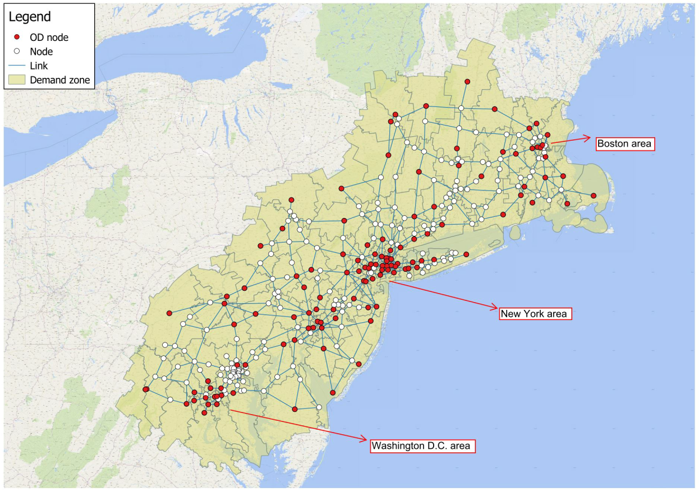

## DC-NY-BOS Network Dataset


This is a highway network dataset of the US Northeast region, covering Washington DC, New York and
Boston.

See also [the dataset for the Korean Expressway network](https://github.com/STOM-Group/KoreanExpressway).

### Data Description
The network is created with [QGIS](https://www.qgis.org/en/site/) based on highway network from [Bing Maps](https://www.bing.com/maps) as well as US primary road shapefile from [TIGER Data](https://www.census.gov/geo/maps-data/data/tiger-line.html).
This network contains 317 nodes and 510 undirected arcs (1020 directed arcs).
Based on 2010 Census information from [TIGER Data](https://www.census.gov/geo/maps-data/data/tiger-data.html), 123 nodes are selected as Origin-Destination nodes in this network.

This dataset was used to study multi-period planning of level 3 charger locations for electric vehicles in the following paper:

- [Zhang, A., J.E. Kang, C. Kwon (2017). Incorporating Demand Dynamics in Multi-Period Capacitated Fast-charging Location Planning for Electric Vehicles. *Transportation Research Part B: Methodological*, 103, 5–29.](https://doi.org/10.1016/j.trb.2017.04.016)

### Data Format
Two data files are provided as ```.csv``` files, and a QGIS project is also provided with multiple shapefiles.

The file ```DC_BOS_NY Network.csv``` (size of ~23KB) contains the information of nodes and links.
The origin (```A_Node```) and destination (```B_Node```) of each link are provided.
The length of each link are provided in the unit of kilometers and miles.

The dataset looks as follows:

| A\_Node | B\_Node | Length (km) | Length (mile) | Link\_ID |
|--------|--------|-------------|---------------|---------|
| 1      | 2      | 17.74       | 11.02         | 1       |
| 1      | 7      | 2.92        | 1.81          | 2       |
| 2      | 12     | 12.89       | 8.01          | 3       |
| 2      | 230    | 18.97       | 11.79         | 4       |
| 2      | 1      | 17.74       | 11.02         | 1       |
| 2      | 227    | 5.05        | 3.14          | 370     |
| 3      | 4      | 2.09        | 1.3           | 5       |

The file ```Network demand nodes.csv``` (size of ~2KB) contains the information of population at each demand node.
Demand flow between different OD pairs can be generated based on gravity spatial interaction model if needed. More details can be found [here](https://www.researchgate.net/profile/Morton_Okelly/post/Typical_Error_in_a_Gravity_Model_for_Transport_Modeling/attachment/5b1d21bdb53d2f63c3d0a7e3/AS%3A635958949064704%401528635837160/download/SI+CHAP+3+Calibration.pdf).

The dataset looks as follows:

| Node_ID | Population |
|---------|------------|
| 1       | 382818     |
| 2       | 358487     |
| 3       | 77347      |
| 4       | 255365     |
| 6       | 323584     |
| 7       | 344013     |
| 10      | 391665     |

The [QGIS](https://www.qgis.org/en/site/) project can be loaded with ```.qgs``` file, and the required shapefiles should be automatic loaded from ```DCBOS``` folder.
